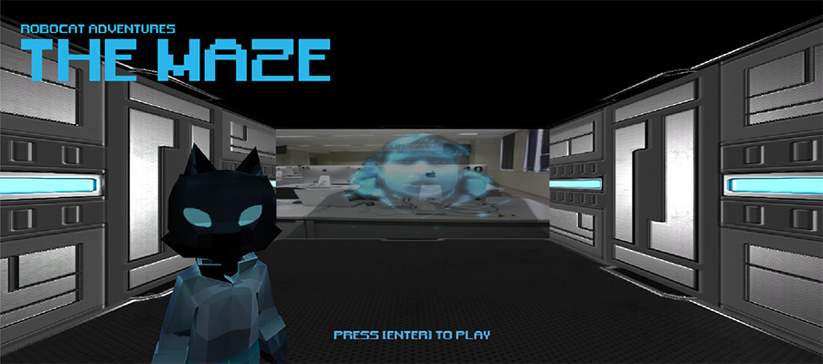
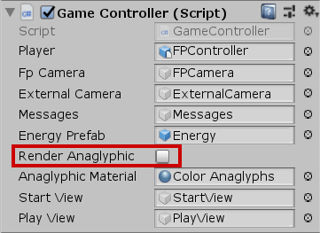

# Robocat Adventures: The Maze Game
A small maze escape game developed in Unity.

## About the game
- You play a robot cat in first-person perpective.
- You have limited time and enery to escape a maze.
- You can charge energy by collecting blue energy flames.
- After getting out of the maze, escape through a portal to win the game.
## Game features
- anaglyphic 3D render option in the GameController

## Technical details
- Unity version:
  - 2018.3.14f1

- Game repository
  - Assets/
    - **00_TheMazeGame/**
    - [Third-party/Unity assets]/
    - ...
